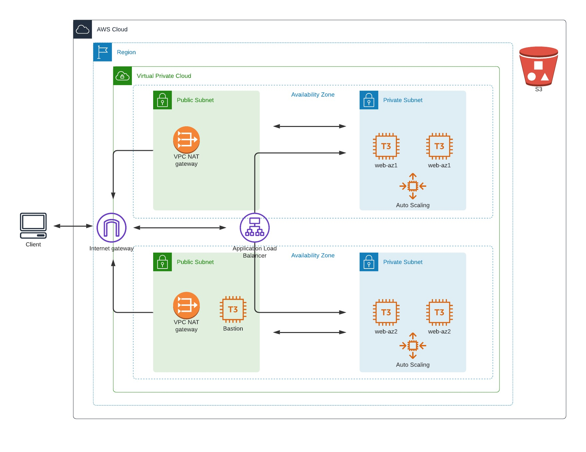

# Project 2 for the [Udacity DevOps Engineer Nanodegree](https://www.udacity.com/course/cloud-dev-ops-nanodegree--nd9991)

## Deploy a High-Availability Web App Using CloudFormation

### Problem
Your company is creating an Instagram clone called Udagram. Developers pushed the latest version of their code in a zip file located in an S3 Bucket. You have been tasked with deploying the application, along with the necessary supporting software into its matching infrastructure. This needs to be done in an automated fashion so that the infrastructure can be discarded as soon as the testing team finishes their tests and gathers their results.


### Requirements
  - 4 servers across 2 AZ's in autoscaling groups
  - 2 vCPUs per server 4G of RAM, and 10G disks running Ubuntu 18
  - One step build/destroy process


---


### Architecture Diagram


### Build the environment
```bash
# Generate the bastion key and build the network and infrastructure
make generate_bastion_key
make build_network # wait for stack to finish deploying
make build_infrastructure

# Output the DNS name of the load balancer
make lb_url
```

### Full usage
```bash
$ make
generate_bastion_key           Create an SSH key to get on the bastion
build_network                  Deploy all VPC stack
build_infrastructure           Deploy app resources: ALB, ASG, etc
update_network_stack           Update network stack
update_infrastructure_stack    Update infrastructure stack
show_stacks                    Show deployed stacks
delete_network                 Delete the network stack
delete_infrastructure          Delete the infrastructure stack
validate_templates             Validate template syntax
ssh_bastion                    SSH to the bastion host
lb_url                         Output the load balancer url
```
